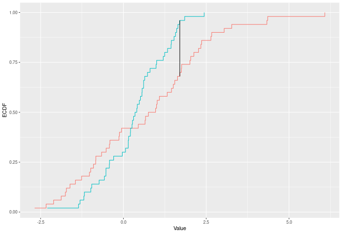
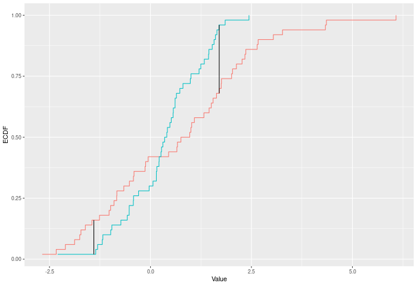
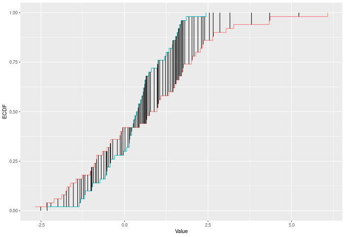
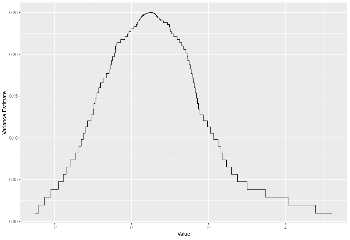
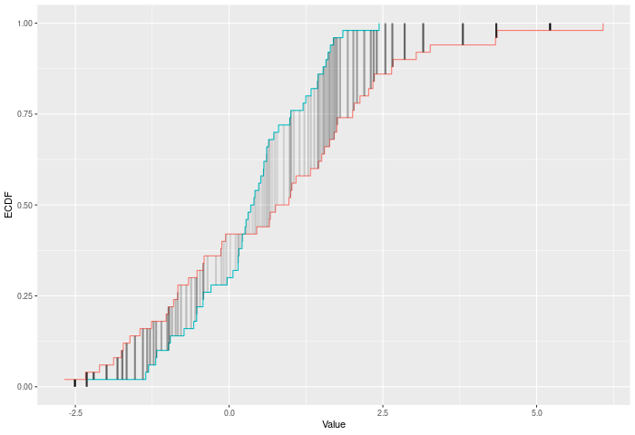
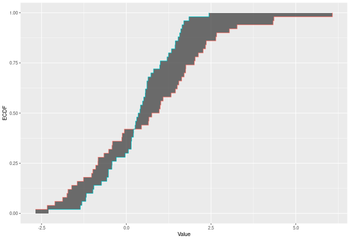

<!-- README.md is generated from README.Rmd. Please edit that file -->

```{r setup, include = FALSE}
knitr::opts_chunk$set(
  collapse = TRUE,
  comment = "#>",
  fig.path = "man/figures/",
  out.width = "100%"
)
```


# twosamples

<!-- badges: start -->
[](https://github.com/cdowd/twosamples/actions/workflows/R-CMD-check.yaml)
<!-- badges: end -->

The goal of twosamples is to allow easy two-sample testing using permutations. This package offers quick (O(n^2) worst) and memory light (O(n)) code for a number of standard distance metrics between two samples. Using permutations of observed samples to calculate null distributions for those metrics, this package also provides assumption free p-values for the samples coming from the same distribution.


Details about the DTS statistic's calculation, and performance can be found [here.](https://arxiv.org/abs/2007.01360)


## Installation

You can install the released version of twosamples from [CRAN](https://CRAN.R-project.org) with:

``` r
install.packages("twosamples")
```

Or you can install the most recent (possibly unstable) version from github:

```r
library(remotes)
install_github("cdowd/twosamples")
```

## Example

In this example, we have 100 observations from two different Normal distributions.

```{r example1}
library(twosamples)
vec1 = rnorm(100)
vec2 = rnorm(100,4)
two_sample(vec1,vec2)
```

## Metric Example Calculations
This section will review each of the different tests offered. I'll offer a brief description of the test mathematically, then some quick intuition. After that, I'll show R code that would build the test statistic -- to provide a full description. That code is not the code underlying this package, but a C++ rewrite of it is.

Each of these test statistics looks at the ECDFs which samples correspond to. I'll refer to E(x) as the ECDF of sample 1, F(x) as the ECDF of sample 2, and G(x) as the ECDF of the joint sample. The ECDF of course takes a real input and returns a value corresponding to the portion of the sample which was observed less than or equal to that point. 

### Kolmogorov-Smirnov Test
The KS test finds the largest difference between the two ECDFs. See `ks_test()`.

<details><summary>Demonstration R Code Calculating Test Statistic</summary>
```{r ks, eval=F}
ks_stat_R = function(vec1,vec2,power=1) {
  n1 = length(vec1)
  n2 = length(vec2)
  n = n1+n2
  
  joint.sample = c(vec1,vec2)
  e = c(rep(1/n1,n1),rep(0,   n2))
  f = c(rep(0,   n1),rep(1/n2,n2))
  
  ind = order(joint.sample)
  d = joint.sample[ind]
  e = e[ind]
  f = f[ind]
  
  out = 0
  Ecur = 0
  Fcur = 0
  height = 0
  for (i in 1:(n-1)) {
    Ecur = Ecur + e[i]
    Fcur = Fcur + f[i]
    if (d[i] != d[i+1]) height = abs(Fcur-Ecur)
    if (height > out) out = height
  }
  out^power
}
```
</details>

In the example plot below, the KS statistic is the height of the vertical black line.




### Kuiper Test
The Kuiper test is much the same as Kolmogorov-Smirnov, but it sums the largest difference in each direction. i.e. it cares about the difference between E(x)-F(x) and F(x)-E(x). In some sense this should be trading some power against mean-shifts for power against variance changes. See `kuiper_test()`

<details><summary>Demonstration R Code Calculating Test Statistic</summary>
```{r kuiper, eval=F, class.source = 'fold-hide'}
kuiper_stat_R = function(vec1,vec2,power=1) { 
  n1 = length(vec1)
  n2 = length(vec2)
  n = n1+n2
  
  joint.sample = c(vec1,vec2)
  e = c(rep(1/n1,n1),rep(0,   n2))
  f = c(rep(0,   n1),rep(1/n2,n2))
  
  ind = order(joint.sample)
  d = joint.sample[ind]
  e = e[ind]
  f = f[ind]
  
  up = 0
  down = 0
  Ecur = 0
  Fcur = 0
  height = 0
  for (i in 1:(n-1)) {
    Ecur = Ecur + e[i]
    Fcur = Fcur + f[i]
    if (d[i] != d[i+1]) height = Fcur-Ecur
    if (height > up) up = height
    if (height < down) down = height
  }
  abs(down)^power + abs(up)^power
}
```
</details>

In the example plot below, the Kuiper statistic is the sum of the heights of the vertical black lines.



### Cramer-Von Mises
The Cramer-Von Mises criterion further extends the intuition of Kuiper and KS. It is actually the full sum across every observation X of the difference |F(x)-E(x)|. This use of the full joint sample gives it a substantial power gain, particularly against higher moments shifting. See `cvm_test()`. 

<details><summary>Demonstration R Code Calculating Test Statistic</summary>
```{r cvm, eval=F}
cvm_stat_R = function(vec1,vec2,power=2){
  n1 = length(vec1)
  n2 = length(vec2)
  n = n1+n2
  
  joint.sample = c(vec1,vec2)
  e = c(rep(1/n1,n1),rep(0,   n2))
  f = c(rep(0,   n1),rep(1/n2,n2))
  
  ind = order(joint.sample)
  d = joint.sample[ind]
  e = e[ind]
  f = f[ind]
  
  out = 0
  Ecur = 0
  Fcur = 0
  height = 0
  dups = 1
  for (i in 1:(n-1)) {
    Ecur = Ecur + e[i]
    Fcur = Fcur + f[i]
    height = abs(Fcur-Ecur)
    if (d[i] != d[i+1]) {
      out = out + (height^power)*dups
      dups = 1
    } else if (d[i] == d[i+1]) {
      dups = dups+1
    }
  }
  out
}
```
</details>

In the example plot below, the CVM statistic is the sum of the heights of the vertical black lines.




### Anderson-Darling
Anderson-Darling test starts from the Cramer-Von Mises logic. However, they note that some points on the joint ECDF are higher variance than others. Because there is more noise in those observations, they should receive a lower weight. More than that, we can even describe the 'optimal' weighting function -- it is closely related to the joint ECDF - G. See `ad_test()`

<details><summary>Demonstration R Code Calculating Test Statistic</summary>
```{r ad, eval=F} 
ad_stat_R = function(vec1,vec2,power=2){
  n1 = length(vec1)
  n2 = length(vec2)
  n = n1+n2
  
  joint.sample = c(vec1,vec2)
  e = c(rep(1/n1,n1),rep(0,   n2))
  f = c(rep(0,   n1),rep(1/n2,n2))
  
  ind = order(joint.sample)
  d = joint.sample[ind]
  e = e[ind]
  f = f[ind]
  
  out = 0
  Ecur = 0
  Fcur = 0
  Gcur = 0
  height = 0
  dups = 1
  
  for (i in 1:(n-1)) {
    Ecur = Ecur + e[i]
    Fcur = Fcur + f[i]
    Gcur = Gcur+1/n
    sd = (2*Gcur*(1-Gcur)/n)**0.5
    height = abs(Fcur-Ecur)
    if (d[i] != d[i+1]) {
      out = out + ((height/sd)^power)*dups
      dups = 1
    } else if (d[i] == d[i+1]) {
      dups = dups+1
    }
  }
  out
}
```
</details>

In the example plot below, we see the variance of the joint ECDF over the range of the data. It clearly peaks in the middle of the joint sample.



In the example plot below, the AD statistic is the weighted sum of the heights of the vertical lines, where weights are represented by the shading of the lines.




### Wasserstein
The Wasserstein distance is not normally a two-sample distance, but the extension is very simple. In terms of the ECDFs it can actually be described as the area between the ECDFs. Intuitively, the improvement this offers over CVM is that it allows more extreme values to change our conclusions. That is to say -- KS, Kuiper, CVM, and AD have all operated on ordinal variables, with no sense of the distance between different rank order observations. Wasserstein (and below DTS) will require interval data. By utilizing the extra information encoded when information is from interval data, Wasserstein and DTS will improve on CVM and AD. See `wass_test()`

<details><summary>Demonstration R Code Calculating Test Statistic</summary>
```{r wass, eval=F}
wass_stat_R = function(vec1,vec2,power=1) {
  n1 = length(vec1)
  n2 = length(vec2)
  n = n1+n2
  
  joint.sample = c(vec1,vec2)
  e = c(rep(1/n1,n1),rep(0,   n2))
  f = c(rep(0,   n1),rep(1/n2,n2))
  
  ind = order(joint.sample)
  d = joint.sample[ind]
  e = e[ind]
  f = f[ind]
  
  out = 0
  Ecur = 0
  Fcur = 0
  height = 0
  width = 0
  for (i in 1:(n-1)) {
    Ecur = Ecur + e[i]
    Fcur = Fcur + f[i]
    height = abs(Fcur-Ecur)
    width = d[i+1]-d[i]
    out = out + (height^power)*width
  }
  out
}
```
</details>


In the example plot below, the Wasserstein statistic is the shaded area between the ECDFs.



### DTS/two_sample
If the Wasserstein metric improves on CVM by moving it into the realm of interval data, then DTS improves on AD by doing the same. Alternately -- DTS offers the same improvement over Wasserstein that AD offers over CVM. See `dts_test()` (AKA `two_sample()` ). 

<details><summary>Demonstration R Code Calculating Test Statistic</summary>
```{r dts, eval=F}
dts_stat_R = function(vec1,vec2,power=1) {
  n1 = length(vec1)
  n2 = length(vec2)
  n = n1+n2
  
  joint.sample = c(vec1,vec2)
  e = c(rep(1/n1,n1),rep(0,   n2))
  f = c(rep(0,   n1),rep(1/n2,n2))
  
  ind = order(joint.sample)
  d = joint.sample[ind]
  e = e[ind]
  f = f[ind]
  
  out = 0
  Ecur = 0
  Fcur = 0
  Gcur = 0
  height = 0
  width = 0 
  for (i in 1:(n-1)) {
    Ecur = Ecur + e[i]
    Fcur = Fcur + f[i]
    Gcur = Gcur+1/n
    sd = (2*Gcur*(1-Gcur)/n)**0.5
    height = abs(Fcur-Ecur)
    width = d[i+1]-d[i]
    out = out + ((height/sd)^power)*width
  }
  out
}
```
</details>

In the example plot below, the DTS statistic is the shaded area between the ECDFs, weighted by the variances -- shown by the color of the shading.


## Permutation Testing
Once we have a metric measuring distance between two samples, its easy enough to code up a testing procedure.

Specifically we want to test the following:
* H0: J=K

where Sample 1 is distributed i.i.d. from  J and Sample 2 is i.i.d. from K.

Broadly, under this null, observations from sample 1 and sample 2 are exchangeable.That is -- by randomly swapping observations between the samples, we can generate a new, equally likely data set from the same (Null) DGP. Then we can calculate our metric for distance between the samples on this data set. By repeating this procedure many times, we can generate a null distribution for our distance metric. We can then compare our observed distance to the null distribution. Because distances are non-negative, this will be a one-sided comparison. (Though if you wanted to test whether a sample was hyper-regular you could do that by looking at the one-sided test to the bottom). 

Moreover, unlike other, more general, two-sample procedures we do not rely on any properties of the underlying distribution. Some procedures require continuity, derivatives, or smoothness to get their asymptotic and finite sample guarantees. Those are procedures which estimate the underlying density, rather than simply working working the ECDF. The testing procedures in this package only rely on the statement that observations are i.i.d.
The Independence is necessary for the exchangeability statement to hold. The identicality is necessary for the null hypothesis to be a sensible claim.
