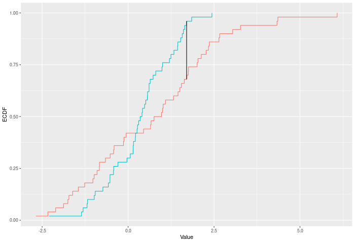
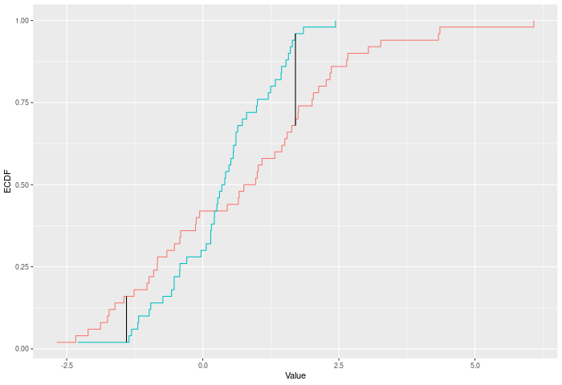
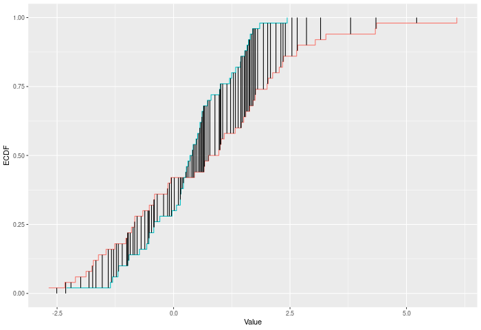
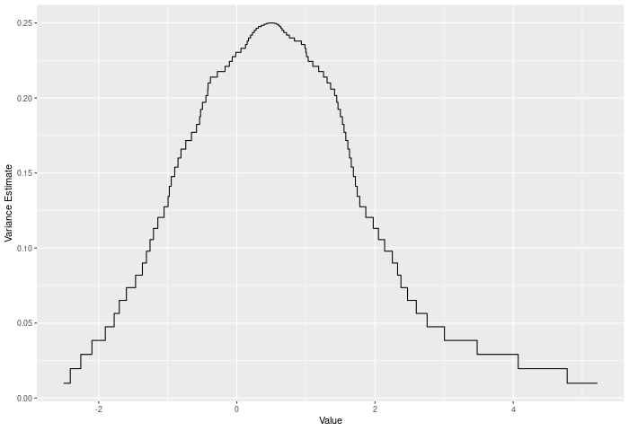
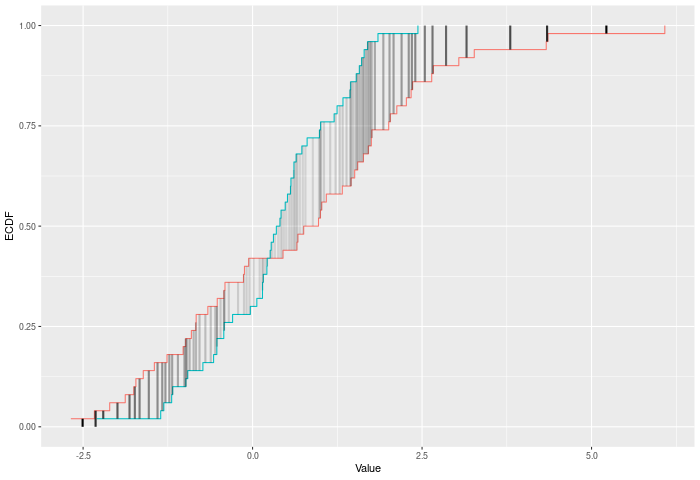
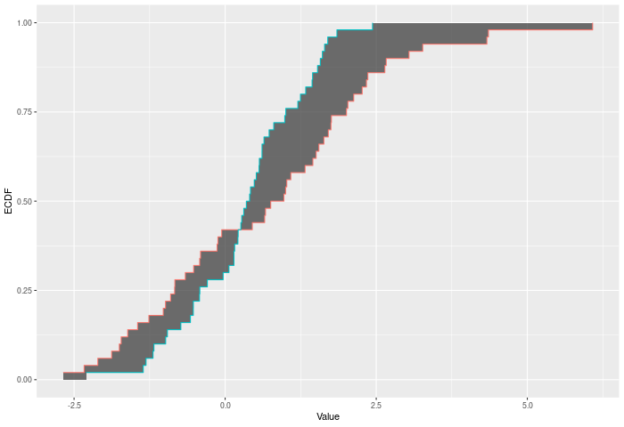
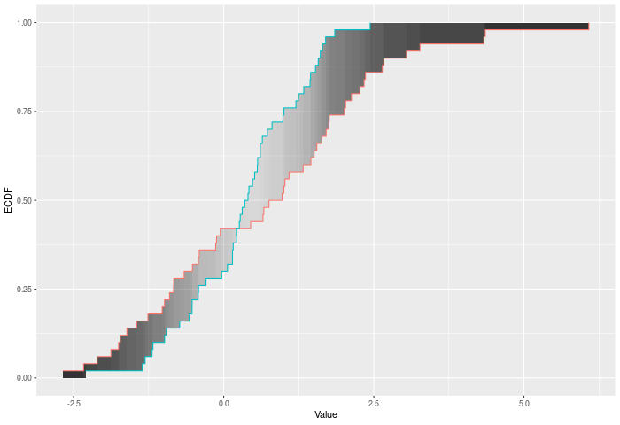

<!-- README.md is generated from README.Rmd. Please edit that file -->

# twosamples

<!-- badges: start -->

[](https://github.com/cdowd/twosamples/actions/workflows/R-CMD-check.yaml)

[](https://github.com/cdowd/twosamples/actions/workflows/pages/pages-build-deployment)

<!-- badges: end -->

The goal of twosamples is to allow easy two-sample testing using
permutations. This package offers quick (O(n^2) worst) and memory light
(O(n)) code for a number of standard distance metrics between two
samples. Using permutations of observed samples to calculate null
distributions for those metrics, this package also provides assumption
free p-values for the samples coming from the same distribution.

Details about the DTS statistic’s calculation, and performance can be
found [here.](https://arxiv.org/abs/2007.01360)

Example R code which works to build test functions can be found on
github
[here.](https://github.com/cdowd/twosamples/blob/main/R/Extras/test_stats_R.R)
This code uses the release v1.0.0 algorithm for simplicity, and is in R
rather than C++, so is substantially slower.

## Installation

You can install the released version of twosamples from
[CRAN](https://CRAN.R-project.org) with:

``` r
install.packages("twosamples")
```

Or you can install the most recent (possibly unstable) version from
github:

``` r
library(remotes)
install_github("cdowd/twosamples")
```

#### System Requirements

Going forward (v2.0.0 onwards), `twosamples` depends on having C++11
installed. This is true of most R platforms and available for all of
them. Compilation also requires headers from the `cpp11` package.

## Example

In this example, we have 100 observations from two different Normal
distributions.

``` r
library(twosamples)
vec1 = rnorm(100)
vec2 = rnorm(100,0.5)
output = two_sample(vec1,vec2)
output
#> Test Stat   P-Value 
#>  14.89630   0.00025
#> No bootstrap values were more extreme than the observed value. 
#>  p-value = 1/(2*bootstraps) is an imprecise placeholder
summary(output)
#> DTS Test 
#> =========================
#> Test Statistic: 14.8963 
#>        P-Value: 0.00025 *
#> - - - - - - - - - - - - -
#>      n1      n2 n.boots 
#>     100     100    2000 
#> =========================
#> Test stat rejection threshold for alpha = 0.05 is: 9.532266 
#> Null rejected: samples are from different distributions
#>  Max observed bootstrap value: 13.77085
#> No bootstrap values were more extreme than the observed value. 
#>  p-value = 1/(2*bootstraps) is an imprecise placeholder
plot(output)
```


## Metric Example Calculations

This section will review each of the different tests offered. I’ll offer
a brief description of the test mathematically, then some quick
intuition. After that, I’ll show R code that would build the test
statistic – to provide a full description. That code is not the code
underlying this package, but a C++ rewrite of it is.

Each of these test statistics looks at the ECDFs which samples
correspond to. I’ll refer to E(x) as the ECDF of sample 1, F(x) as the
ECDF of sample 2, and G(x) as the ECDF of the joint sample. The ECDF of
course takes a real input and returns a value corresponding to the
portion of the sample which was observed less than or equal to that
point.

### Kolmogorov-Smirnov Test

The KS test finds the largest (vertical) difference between the two
ECDFs. See `ks_test()`.

<details>
<summary>
Demonstration R Code Calculating Test Statistic
</summary>

``` r
ks_stat_R = function(vec1,vec2,power=1) {
  n1 = length(vec1)
  n2 = length(vec2)
  n = n1+n2
  
  joint.sample = c(vec1,vec2)
  e = c(rep(1/n1,n1),rep(0,   n2))
  f = c(rep(0,   n1),rep(1/n2,n2))
  
  ind = order(joint.sample)
  d = joint.sample[ind]
  e = e[ind]
  f = f[ind]
  
  out = 0
  Ecur = 0
  Fcur = 0
  height = 0
  for (i in 1:(n-1)) {
    Ecur = Ecur + e[i]
    Fcur = Fcur + f[i]
    if (d[i] != d[i+1]) height = abs(Fcur-Ecur)
    if (height > out) out = height
  }
  out^power
}
```

</details>

In the example plot below, the KS statistic is the height of the
vertical black line.



### Kuiper Test

The Kuiper test is much the same as Kolmogorov-Smirnov, but it sums the
largest difference in each direction. i.e. it cares about the difference
between E(x)-F(x) and F(x)-E(x). In some sense this should be trading
some power against mean-shifts for power against variance changes. See
`kuiper_test()`

<details>
<summary>
Demonstration R Code Calculating Test Statistic
</summary>

``` r
kuiper_stat_R = function(vec1,vec2,power=1) { 
  n1 = length(vec1)
  n2 = length(vec2)
  n = n1+n2
  
  joint.sample = c(vec1,vec2)
  e = c(rep(1/n1,n1),rep(0,   n2))
  f = c(rep(0,   n1),rep(1/n2,n2))
  
  ind = order(joint.sample)
  d = joint.sample[ind]
  e = e[ind]
  f = f[ind]
  
  up = 0
  down = 0
  Ecur = 0
  Fcur = 0
  height = 0
  for (i in 1:(n-1)) {
    Ecur = Ecur + e[i]
    Fcur = Fcur + f[i]
    if (d[i] != d[i+1]) height = Fcur-Ecur
    if (height > up) up = height
    if (height < down) down = height
  }
  abs(down)^power + abs(up)^power
}
```

</details>

In the example plot below, the Kuiper statistic is the sum of the
heights of the vertical black lines.



### Cramer-Von Mises

The Cramer-Von Mises criterion further extends the intuition of Kuiper
and KS. It is actually the full sum across every observation X of the
difference \|F(x)-E(x)\|. This use of the full joint sample gives it a
substantial power gain, particularly against higher moments shifting.
See `cvm_test()`.

<details>
<summary>
Demonstration R Code Calculating Test Statistic
</summary>

``` r
cvm_stat_R = function(vec1,vec2,power=2){
  n1 = length(vec1)
  n2 = length(vec2)
  n = n1+n2
  
  joint.sample = c(vec1,vec2)
  e = c(rep(1/n1,n1),rep(0,   n2))
  f = c(rep(0,   n1),rep(1/n2,n2))
  
  ind = order(joint.sample)
  d = joint.sample[ind]
  e = e[ind]
  f = f[ind]
  
  out = 0
  Ecur = 0
  Fcur = 0
  height = 0
  dups = 1
  for (i in 1:(n-1)) {
    Ecur = Ecur + e[i]
    Fcur = Fcur + f[i]
    height = abs(Fcur-Ecur)
    if (d[i] != d[i+1]) {
      out = out + (height^power)*dups
      dups = 1
    } else if (d[i] == d[i+1]) {
      dups = dups+1
    }
  }
  out
}
```

</details>

In the example plot below, the CVM statistic is the sum of the heights
of the vertical black lines.



### Anderson-Darling

Anderson-Darling test starts from the Cramer-Von Mises logic. However,
they note that some points on the joint ECDF are higher variance than
others. Because there is more noise in those observations, they should
receive a lower weight. More than that, we can even describe the
‘optimal’ weighting function – it is closely related to the joint ECDF -
G. See `ad_test()`

<details>
<summary>
Demonstration R Code Calculating Test Statistic
</summary>

``` r
ad_stat_R = function(vec1,vec2,power=2){
  n1 = length(vec1)
  n2 = length(vec2)
  n = n1+n2
  
  joint.sample = c(vec1,vec2)
  e = c(rep(1/n1,n1),rep(0,   n2))
  f = c(rep(0,   n1),rep(1/n2,n2))
  
  ind = order(joint.sample)
  d = joint.sample[ind]
  e = e[ind]
  f = f[ind]
  
  out = 0
  Ecur = 0
  Fcur = 0
  Gcur = 0
  height = 0
  dups = 1
  
  for (i in 1:(n-1)) {
    Ecur = Ecur + e[i]
    Fcur = Fcur + f[i]
    Gcur = Gcur+1/n
    sd = (2*Gcur*(1-Gcur)/n)**0.5
    height = abs(Fcur-Ecur)
    if (d[i] != d[i+1]) {
      out = out + ((height/sd)^power)*dups
      dups = 1
    } else if (d[i] == d[i+1]) {
      dups = dups+1
    }
  }
  out
}
```

</details>

In the example plot below, we see the variance of the joint ECDF over
the range of the data. It clearly peaks in the middle of the joint
sample.



In the example plot below, the AD statistic is the weighted sum of the
heights of the vertical lines, where weights are represented by the
shading of the lines.



### Wasserstein

The Wasserstein distance is not normally a two-sample distance, but the
extension is very simple. In terms of the ECDFs it can actually be
described as the area between the ECDFs. Intuitively, the improvement
this offers over CVM is that it allows more extreme values to change our
conclusions. That is to say – KS, Kuiper, CVM, and AD have all operated
on ordinal variables, with no sense of the distance between different
rank order observations. Wasserstein (and below DTS) will require
interval data. By utilizing the extra information encoded when
information is from interval data, Wasserstein and DTS will improve on
CVM and AD. See `wass_test()`

<details>
<summary>
Demonstration R Code Calculating Test Statistic
</summary>

``` r
wass_stat_R = function(vec1,vec2,power=1) {
  n1 = length(vec1)
  n2 = length(vec2)
  n = n1+n2
  
  joint.sample = c(vec1,vec2)
  e = c(rep(1/n1,n1),rep(0,   n2))
  f = c(rep(0,   n1),rep(1/n2,n2))
  
  ind = order(joint.sample)
  d = joint.sample[ind]
  e = e[ind]
  f = f[ind]
  
  out = 0
  Ecur = 0
  Fcur = 0
  height = 0
  width = 0
  for (i in 1:(n-1)) {
    Ecur = Ecur + e[i]
    Fcur = Fcur + f[i]
    height = abs(Fcur-Ecur)
    width = d[i+1]-d[i]
    out = out + (height^power)*width
  }
  out
}
```

</details>

In the example plot below, the Wasserstein statistic is the shaded area
between the ECDFs.



### DTS/two_sample

If the Wasserstein metric improves on CVM by moving it into the realm of
interval data, then DTS improves on AD by doing the same. Alternately –
DTS offers the same improvement over Wasserstein that AD offers over
CVM. See `dts_test()` (AKA `two_sample()` ).

<details>
<summary>
Demonstration R Code Calculating Test Statistic
</summary>

``` r
dts_stat_R = function(vec1,vec2,power=1) {
  n1 = length(vec1)
  n2 = length(vec2)
  n = n1+n2
  
  joint.sample = c(vec1,vec2)
  e = c(rep(1/n1,n1),rep(0,   n2))
  f = c(rep(0,   n1),rep(1/n2,n2))
  
  ind = order(joint.sample)
  d = joint.sample[ind]
  e = e[ind]
  f = f[ind]
  
  out = 0
  Ecur = 0
  Fcur = 0
  Gcur = 0
  height = 0
  width = 0 
  for (i in 1:(n-1)) {
    Ecur = Ecur + e[i]
    Fcur = Fcur + f[i]
    Gcur = Gcur+1/n
    sd = (2*Gcur*(1-Gcur)/n)**0.5
    height = abs(Fcur-Ecur)
    width = d[i+1]-d[i]
    out = out + ((height/sd)^power)*width
  }
  out
}
```

</details>

In the example plot below, the DTS statistic is the shaded area between
the ECDFs, weighted by the variances – shown by the color of the
shading.



## Permutation Testing

Once we have a metric measuring distance between two samples, its easy
enough to code up a testing procedure.

Specifically we want to test the following: \* H0: J=K

where Sample 1 is distributed i.i.d. from J and Sample 2 is i.i.d. from
K.

Broadly, under this null, observations from sample 1 and sample 2 are
exchangeable.That is – by randomly swapping observations between the
samples, we can generate a new, equally likely data set from the same
(Null) DGP. Then we can calculate our metric for distance between the
samples on this data set. By repeating this procedure many times, we can
generate a null distribution for our distance metric. We can then
compare our observed distance to the null distribution. Because
distances are non-negative, this will be a one-sided comparison. (Though
if you wanted to test whether a sample was hyper-regular you could do
that by looking at the one-sided test to the bottom).

Moreover, unlike other, more general, two-sample procedures we do not
rely on any properties of the underlying distribution. Some procedures
require continuity, derivatives, or smoothness to get their asymptotic
and finite sample guarantees. Those are procedures which estimate the
underlying density, rather than simply working working the ECDF. The
testing procedures in this package only rely on the statement that
observations are i.i.d. The Independence is necessary for the
exchangeability statement to hold. The identicality is necessary for the
null hypothesis to be a sensible claim.
